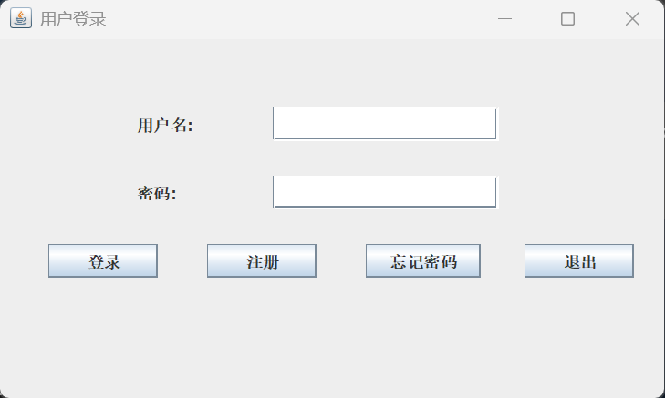
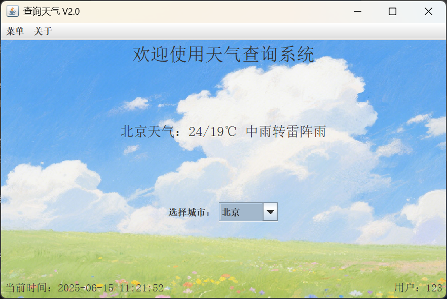

# 项目名称

## 项目简介
简要介绍你们的课程设计项目，包括目的、意义、应用场景等。

## 项目采用技术
- 前端：如 React、Vue、HTML5、CSS3 等
- 后端：如 Node.js、Django、Spring Boot 等
- 数据库：如 MySQL、MongoDB 等
- 其他：如第三方API、云服务等

## 功能需求分析
1. 功能一：描述主要功能点
2. 功能二：描述主要功能点
3. 功能三：描述主要功能点
...

## 项目亮点
- 亮点1
- 亮点2
- 亮点3
...

## 主要功能截图

### 主要功能截图
1. 登录界面  
   
2. 注册界面
   
3. 修改密码界面
   
4. 主页面  
   
5. 其它功能  
   

## 团队成员负责模块

| 姓名 | GitHub用户名 | 负责模块           |
|------|--------------|--------------------|
| 张三 | user1        | 前端页面开发        |
| 李四 | user2        | 后端接口设计与实现   |
| 王五 | user3        | 数据库设计与优化     |
| 赵六 | user4        | 系统测试与文档编写   |

## 项目Git地址
[https://github.com/suisuiyuanpingan/suisuiyuanpingan.github.io](https://github.com/suisuiyuanpingan/suisuiyuanpingan.github.io)

## 团队成员Git提交记录截图
请将每位成员的 git log 或贡献记录截图保存至 images 文件夹，并在下方展示：

1. 张三提交记录  
   
2. 李四提交记录  
   
3. 王五提交记录  
   
4. 赵六提交记录  
   

---

> 请根据实际情况完善内容和补充图片，效果如下图所示：

- 左侧为导航，右侧为内容
- 每个板块分明，便于查阅
- 可继续添加 _posts 下的文章，丰富博客内容
